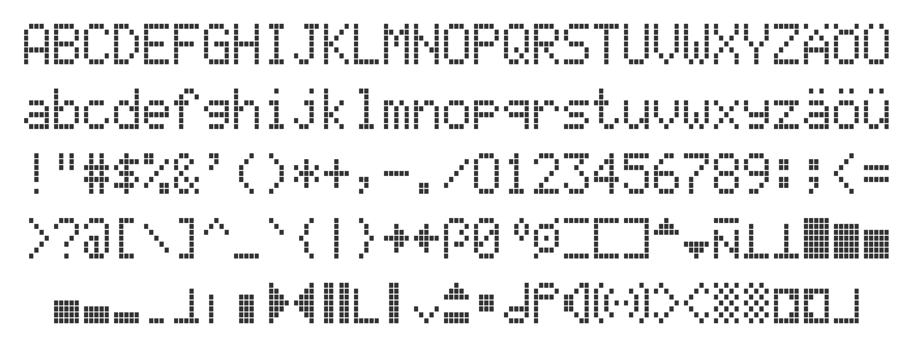
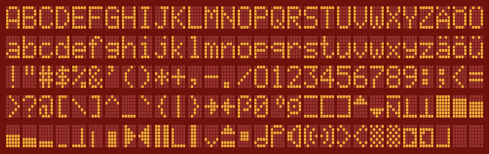

# MID pixels

A custom 5x7 pixel font comprising all the characters and symbols displayed on the BMW Multi Information Display (MID) on E38 and E39 models. The characters might also be in use on other I-BUS LCD displays (instrument cluster, radio, etc). The character set is custom and matches the ASCII character set from characters 32 to 125. Above code point 125, the character set is custom and very specific to the symbols needed for displaying system controls such as volume, arrows, bars, and various symbols. Two of the used code points (127 and 173) are control characters that do not display in a font (delete and soft-hyphen, respectively), so I have remapped those two symbols to other code points in the font. Otherwise, the code points are the same for IBUS usage and in the font.

<!--<picture>
  <source media="(prefers-color-scheme: dark)" srcset="./assets/sample-dark.png">
  
</picture>-->



## Character map

| | | | | | | | | |
|:----:|:----:|:----:|:----:|:----:|:----:|:----:|:----:|:----:|
| symbol<br/>IBUS Hex<br/>Font codepoint | <br/>0x20<br/>032 | <br/>0x21<br/>033 | <br/>0x22<br/>034 | <br/>0x23<br/>035 | 0x24 | 0x25 | 0x26 | 0x27 | 0x28 | 0x29 | 0x2A | 0x2B | 0x2C | 0x2D | 0x2E | 0x2F |


<table>
  <tbody>
    <tr>
      <td align="center">
        <br/>
        0x20<br/>
        032
      </td>
      <td align="center">
        <br/>
        0x21<br/>
        033
      </td>
      <td align="center">
        <br/>
        0x22<br/>
        034
      </td>
      <td align="center">
        <br/>
        0x23<br/>
        035
      </td>
      <td align="center">
        <br/>
        0x24<br/>
        036
      </td>
      <td align="center">
        <br/>
        0x25<br/>
        037
      </td>
      <td align="center">
        <br/>
        0x26<br/>
        038
      </td>
      <td align="center">
        <br/>
        0x27<br/>
        039
      </td>
      <td align="center">
        <br/>
        0x28<br/>
        040
      </td>
      <td align="center">
        <br/>
        0x29<br/>
        041
      </td>
      <td align="center">
        <br/>
        0x30<br/>
        042
      </td>
      <td align="center">
        <br/>
        0x31<br/>
        043
      </td>
    </tr>
  </tbody>
</table>

## Background

Using a customized test harness (ibus usb adapter, custom code), I sent all possible 8-bit values to a MID display and mapped the pixels for each character. There are a total of 144 displayable characters/symbols. See the map in [characters.js](./src/characters.js).

## Building the font

Prerequisites:
* nodejs 18+

```bash
npm install
npm run build
```

Individual svg files will be created in the `svg` directory. Usable font files will be created in the `dist` directory. A sample/preview page is also created in the `dist` directory.

