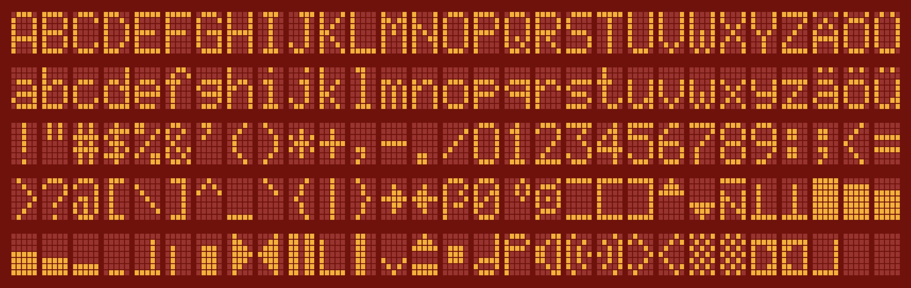

# MID pixels

A custom 5x7 pixel font comprising all the characters and symbols displayed on the BMW Multi Information Display (MID) on E38 and E39 models. The characters are probably also in use on other IBUS LCD displays (instrument cluster, radio, etc). The character set matches the ASCII character set from characters 32 to 125 (A-Z, numbers, punctuation, etc). Above code point 125, the character set is custom and very specific to the symbols needed for displaying system controls such as volume, arrows, bars, and various symbols. Three of those upper code points (127, 160, and 173) are characters that do not display nicely in a font (control characters such as delete and soft-hyphen), so I have remapped those symbols to other code points in the font. Otherwise, the code points are the same for IBUS usage and in the font.



## Character map

<table>
  <tbody>
    <tr>
      <td align="center">
        <picture>
          <source media="(prefers-color-scheme: dark)" srcset="https://dfuchslin.github.io/midpixels/png/032-dark.png">
          <source media="(prefers-color-scheme: light)" srcset="https://dfuchslin.github.io/midpixels/png/032.png">
          
        </picture>
        0x20<br/>
        32<br/>
        &nbsp;
      </td>
      <td align="center">
        <picture>
          <source media="(prefers-color-scheme: dark)" srcset="https://dfuchslin.github.io/midpixels/png/033-dark.png">
          <source media="(prefers-color-scheme: light)" srcset="https://dfuchslin.github.io/midpixels/png/033.png">
          
        </picture>
        0x21<br/>
        33<br/>
        &#33;
      </td>
      <td align="center">
        <picture>
          <source media="(prefers-color-scheme: dark)" srcset="https://dfuchslin.github.io/midpixels/png/034-dark.png">
          <source media="(prefers-color-scheme: light)" srcset="https://dfuchslin.github.io/midpixels/png/034.png">
          
        </picture>
        0x22<br/>
        34<br/>
        &#34;
      </td>
      <td align="center">
        <picture>
          <source media="(prefers-color-scheme: dark)" srcset="https://dfuchslin.github.io/midpixels/png/035-dark.png">
          <source media="(prefers-color-scheme: light)" srcset="https://dfuchslin.github.io/midpixels/png/035.png">
          
        </picture>
        0x23<br/>
        35<br/>
        &#35;
      </td>
      <td align="center">
        <picture>
          <source media="(prefers-color-scheme: dark)" srcset="https://dfuchslin.github.io/midpixels/png/036-dark.png">
          <source media="(prefers-color-scheme: light)" srcset="https://dfuchslin.github.io/midpixels/png/036.png">
          
        </picture>
        0x24<br/>
        36<br/>
        &#36;
      </td>
      <td align="center">
        <picture>
          <source media="(prefers-color-scheme: dark)" srcset="https://dfuchslin.github.io/midpixels/png/037-dark.png">
          <source media="(prefers-color-scheme: light)" srcset="https://dfuchslin.github.io/midpixels/png/037.png">
          
        </picture>
        0x25<br/>
        37<br/>
        &#37;
      </td>
      <td align="center">
        <picture>
          <source media="(prefers-color-scheme: dark)" srcset="https://dfuchslin.github.io/midpixels/png/038-dark.png">
          <source media="(prefers-color-scheme: light)" srcset="https://dfuchslin.github.io/midpixels/png/038.png">
          
        </picture>
        0x26<br/>
        38<br/>
        &#38;
      </td>
      <td align="center">
        <picture>
          <source media="(prefers-color-scheme: dark)" srcset="https://dfuchslin.github.io/midpixels/png/039-dark.png">
          <source media="(prefers-color-scheme: light)" srcset="https://dfuchslin.github.io/midpixels/png/039.png">
          
        </picture>
        0x27<br/>
        39<br/>
        &#39;
      </td>
      <td align="center">
        <picture>
          <source media="(prefers-color-scheme: dark)" srcset="https://dfuchslin.github.io/midpixels/png/040-dark.png">
          <source media="(prefers-color-scheme: light)" srcset="https://dfuchslin.github.io/midpixels/png/040.png">
          
        </picture>
        0x28<br/>
        40<br/>
        &#40;
      </td>
      <td align="center">
        <picture>
          <source media="(prefers-color-scheme: dark)" srcset="https://dfuchslin.github.io/midpixels/png/041-dark.png">
          <source media="(prefers-color-scheme: light)" srcset="https://dfuchslin.github.io/midpixels/png/041.png">
          
        </picture>
        0x29<br/>
        41<br/>
        &#41;
      </td>
      <td align="center">
        <picture>
          <source media="(prefers-color-scheme: dark)" srcset="https://dfuchslin.github.io/midpixels/png/042-dark.png">
          <source media="(prefers-color-scheme: light)" srcset="https://dfuchslin.github.io/midpixels/png/042.png">
          
        </picture>
        0x2A<br/>
        42<br/>
        &#42;
      </td>
      <td align="center">
        <picture>
          <source media="(prefers-color-scheme: dark)" srcset="https://dfuchslin.github.io/midpixels/png/043-dark.png">
          <source media="(prefers-color-scheme: light)" srcset="https://dfuchslin.github.io/midpixels/png/043.png">
          
        </picture>
        0x2B<br/>
        43<br/>
        &#43;
      </td>
    </tr>
    <tr>
      <td align="center">
        <picture>
          <source media="(prefers-color-scheme: dark)" srcset="https://dfuchslin.github.io/midpixels/png/044-dark.png">
          <source media="(prefers-color-scheme: light)" srcset="https://dfuchslin.github.io/midpixels/png/044.png">
          
        </picture>
        0x2C<br/>
        44<br/>
        &#44;
      </td>
      <td align="center">
        <picture>
          <source media="(prefers-color-scheme: dark)" srcset="https://dfuchslin.github.io/midpixels/png/045-dark.png">
          <source media="(prefers-color-scheme: light)" srcset="https://dfuchslin.github.io/midpixels/png/045.png">
          
        </picture>
        0x2D<br/>
        45<br/>
        &#45;
      </td>
      <td align="center">
        <picture>
          <source media="(prefers-color-scheme: dark)" srcset="https://dfuchslin.github.io/midpixels/png/046-dark.png">
          <source media="(prefers-color-scheme: light)" srcset="https://dfuchslin.github.io/midpixels/png/046.png">
          
        </picture>
        0x2E<br/>
        46<br/>
        &#46;
      </td>
      <td align="center">
        <picture>
          <source media="(prefers-color-scheme: dark)" srcset="https://dfuchslin.github.io/midpixels/png/047-dark.png">
          <source media="(prefers-color-scheme: light)" srcset="https://dfuchslin.github.io/midpixels/png/047.png">
          
        </picture>
        0x2F<br/>
        47<br/>
        &#47;
      </td>
      <td align="center">
        <picture>
          <source media="(prefers-color-scheme: dark)" srcset="https://dfuchslin.github.io/midpixels/png/048-dark.png">
          <source media="(prefers-color-scheme: light)" srcset="https://dfuchslin.github.io/midpixels/png/048.png">
          
        </picture>
        0x30<br/>
        48<br/>
        &#48;
      </td>
      <td align="center">
        <picture>
          <source media="(prefers-color-scheme: dark)" srcset="https://dfuchslin.github.io/midpixels/png/049-dark.png">
          <source media="(prefers-color-scheme: light)" srcset="https://dfuchslin.github.io/midpixels/png/049.png">
          
        </picture>
        0x31<br/>
        49<br/>
        &#49;
      </td>
      <td align="center">
        <picture>
          <source media="(prefers-color-scheme: dark)" srcset="https://dfuchslin.github.io/midpixels/png/050-dark.png">
          <source media="(prefers-color-scheme: light)" srcset="https://dfuchslin.github.io/midpixels/png/050.png">
          
        </picture>
        0x32<br/>
        50<br/>
        &#50;
      </td>
      <td align="center">
        <picture>
          <source media="(prefers-color-scheme: dark)" srcset="https://dfuchslin.github.io/midpixels/png/051-dark.png">
          <source media="(prefers-color-scheme: light)" srcset="https://dfuchslin.github.io/midpixels/png/051.png">
          
        </picture>
        0x33<br/>
        51<br/>
        &#51;
      </td>
      <td align="center">
        <picture>
          <source media="(prefers-color-scheme: dark)" srcset="https://dfuchslin.github.io/midpixels/png/052-dark.png">
          <source media="(prefers-color-scheme: light)" srcset="https://dfuchslin.github.io/midpixels/png/052.png">
          
        </picture>
        0x34<br/>
        52<br/>
        &#52;
      </td>
      <td align="center">
        <picture>
          <source media="(prefers-color-scheme: dark)" srcset="https://dfuchslin.github.io/midpixels/png/053-dark.png">
          <source media="(prefers-color-scheme: light)" srcset="https://dfuchslin.github.io/midpixels/png/053.png">
          
        </picture>
        0x35<br/>
        53<br/>
        &#53;
      </td>
      <td align="center">
        <picture>
          <source media="(prefers-color-scheme: dark)" srcset="https://dfuchslin.github.io/midpixels/png/054-dark.png">
          <source media="(prefers-color-scheme: light)" srcset="https://dfuchslin.github.io/midpixels/png/054.png">
          
        </picture>
        0x36<br/>
        54<br/>
        &#54;
      </td>
      <td align="center">
        <picture>
          <source media="(prefers-color-scheme: dark)" srcset="https://dfuchslin.github.io/midpixels/png/055-dark.png">
          <source media="(prefers-color-scheme: light)" srcset="https://dfuchslin.github.io/midpixels/png/055.png">
          
        </picture>
        0x37<br/>
        55<br/>
        &#55;
      </td>
    </tr>
    <tr>
      <td align="center">
        <picture>
          <source media="(prefers-color-scheme: dark)" srcset="https://dfuchslin.github.io/midpixels/png/056-dark.png">
          <source media="(prefers-color-scheme: light)" srcset="https://dfuchslin.github.io/midpixels/png/056.png">
          
        </picture>
        0x38<br/>
        56<br/>
        &#56;
      </td>
      <td align="center">
        <picture>
          <source media="(prefers-color-scheme: dark)" srcset="https://dfuchslin.github.io/midpixels/png/057-dark.png">
          <source media="(prefers-color-scheme: light)" srcset="https://dfuchslin.github.io/midpixels/png/057.png">
          
        </picture>
        0x39<br/>
        57<br/>
        &#57;
      </td>
      <td align="center">
        <picture>
          <source media="(prefers-color-scheme: dark)" srcset="https://dfuchslin.github.io/midpixels/png/058-dark.png">
          <source media="(prefers-color-scheme: light)" srcset="https://dfuchslin.github.io/midpixels/png/058.png">
          
        </picture>
        0x3A<br/>
        58<br/>
        &#58;
      </td>
      <td align="center">
        <picture>
          <source media="(prefers-color-scheme: dark)" srcset="https://dfuchslin.github.io/midpixels/png/059-dark.png">
          <source media="(prefers-color-scheme: light)" srcset="https://dfuchslin.github.io/midpixels/png/059.png">
          
        </picture>
        0x3B<br/>
        59<br/>
        &#59;
      </td>
      <td align="center">
        <picture>
          <source media="(prefers-color-scheme: dark)" srcset="https://dfuchslin.github.io/midpixels/png/060-dark.png">
          <source media="(prefers-color-scheme: light)" srcset="https://dfuchslin.github.io/midpixels/png/060.png">
          
        </picture>
        0x3C<br/>
        60<br/>
        &#60;
      </td>
      <td align="center">
        <picture>
          <source media="(prefers-color-scheme: dark)" srcset="https://dfuchslin.github.io/midpixels/png/061-dark.png">
          <source media="(prefers-color-scheme: light)" srcset="https://dfuchslin.github.io/midpixels/png/061.png">
          
        </picture>
        0x3D<br/>
        61<br/>
        &#61;
      </td>
      <td align="center">
        <picture>
          <source media="(prefers-color-scheme: dark)" srcset="https://dfuchslin.github.io/midpixels/png/062-dark.png">
          <source media="(prefers-color-scheme: light)" srcset="https://dfuchslin.github.io/midpixels/png/062.png">
          
        </picture>
        0x3E<br/>
        62<br/>
        &#62;
      </td>
      <td align="center">
        <picture>
          <source media="(prefers-color-scheme: dark)" srcset="https://dfuchslin.github.io/midpixels/png/063-dark.png">
          <source media="(prefers-color-scheme: light)" srcset="https://dfuchslin.github.io/midpixels/png/063.png">
          
        </picture>
        0x3F<br/>
        63<br/>
        &#63;
      </td>
      <td align="center">
        <picture>
          <source media="(prefers-color-scheme: dark)" srcset="https://dfuchslin.github.io/midpixels/png/064-dark.png">
          <source media="(prefers-color-scheme: light)" srcset="https://dfuchslin.github.io/midpixels/png/064.png">
          
        </picture>
        0x40<br/>
        64<br/>
        &#64;
      </td>
      <td align="center">
        <picture>
          <source media="(prefers-color-scheme: dark)" srcset="https://dfuchslin.github.io/midpixels/png/065-dark.png">
          <source media="(prefers-color-scheme: light)" srcset="https://dfuchslin.github.io/midpixels/png/065.png">
          
        </picture>
        0x41<br/>
        65<br/>
        &#65;
      </td>
      <td align="center">
        <picture>
          <source media="(prefers-color-scheme: dark)" srcset="https://dfuchslin.github.io/midpixels/png/066-dark.png">
          <source media="(prefers-color-scheme: light)" srcset="https://dfuchslin.github.io/midpixels/png/066.png">
          
        </picture>
        0x42<br/>
        66<br/>
        &#66;
      </td>
      <td align="center">
        <picture>
          <source media="(prefers-color-scheme: dark)" srcset="https://dfuchslin.github.io/midpixels/png/067-dark.png">
          <source media="(prefers-color-scheme: light)" srcset="https://dfuchslin.github.io/midpixels/png/067.png">
          
        </picture>
        0x43<br/>
        67<br/>
        &#67;
      </td>
    </tr>
    <tr>
      <td align="center">
        <picture>
          <source media="(prefers-color-scheme: dark)" srcset="https://dfuchslin.github.io/midpixels/png/068-dark.png">
          <source media="(prefers-color-scheme: light)" srcset="https://dfuchslin.github.io/midpixels/png/068.png">
          
        </picture>
        0x44<br/>
        68<br/>
        &#68;
      </td>
      <td align="center">
        <picture>
          <source media="(prefers-color-scheme: dark)" srcset="https://dfuchslin.github.io/midpixels/png/069-dark.png">
          <source media="(prefers-color-scheme: light)" srcset="https://dfuchslin.github.io/midpixels/png/069.png">
          
        </picture>
        0x45<br/>
        69<br/>
        &#69;
      </td>
      <td align="center">
        <picture>
          <source media="(prefers-color-scheme: dark)" srcset="https://dfuchslin.github.io/midpixels/png/070-dark.png">
          <source media="(prefers-color-scheme: light)" srcset="https://dfuchslin.github.io/midpixels/png/070.png">
          
        </picture>
        0x46<br/>
        70<br/>
        &#70;
      </td>
      <td align="center">
        <picture>
          <source media="(prefers-color-scheme: dark)" srcset="https://dfuchslin.github.io/midpixels/png/071-dark.png">
          <source media="(prefers-color-scheme: light)" srcset="https://dfuchslin.github.io/midpixels/png/071.png">
          
        </picture>
        0x47<br/>
        71<br/>
        &#71;
      </td>
      <td align="center">
        <picture>
          <source media="(prefers-color-scheme: dark)" srcset="https://dfuchslin.github.io/midpixels/png/072-dark.png">
          <source media="(prefers-color-scheme: light)" srcset="https://dfuchslin.github.io/midpixels/png/072.png">
          
        </picture>
        0x48<br/>
        72<br/>
        &#72;
      </td>
      <td align="center">
        <picture>
          <source media="(prefers-color-scheme: dark)" srcset="https://dfuchslin.github.io/midpixels/png/073-dark.png">
          <source media="(prefers-color-scheme: light)" srcset="https://dfuchslin.github.io/midpixels/png/073.png">
          
        </picture>
        0x49<br/>
        73<br/>
        &#73;
      </td>
      <td align="center">
        <picture>
          <source media="(prefers-color-scheme: dark)" srcset="https://dfuchslin.github.io/midpixels/png/074-dark.png">
          <source media="(prefers-color-scheme: light)" srcset="https://dfuchslin.github.io/midpixels/png/074.png">
          
        </picture>
        0x4A<br/>
        74<br/>
        &#74;
      </td>
      <td align="center">
        <picture>
          <source media="(prefers-color-scheme: dark)" srcset="https://dfuchslin.github.io/midpixels/png/075-dark.png">
          <source media="(prefers-color-scheme: light)" srcset="https://dfuchslin.github.io/midpixels/png/075.png">
          
        </picture>
        0x4B<br/>
        75<br/>
        &#75;
      </td>
      <td align="center">
        <picture>
          <source media="(prefers-color-scheme: dark)" srcset="https://dfuchslin.github.io/midpixels/png/076-dark.png">
          <source media="(prefers-color-scheme: light)" srcset="https://dfuchslin.github.io/midpixels/png/076.png">
          
        </picture>
        0x4C<br/>
        76<br/>
        &#76;
      </td>
      <td align="center">
        <picture>
          <source media="(prefers-color-scheme: dark)" srcset="https://dfuchslin.github.io/midpixels/png/077-dark.png">
          <source media="(prefers-color-scheme: light)" srcset="https://dfuchslin.github.io/midpixels/png/077.png">
          
        </picture>
        0x4D<br/>
        77<br/>
        &#77;
      </td>
      <td align="center">
        <picture>
          <source media="(prefers-color-scheme: dark)" srcset="https://dfuchslin.github.io/midpixels/png/078-dark.png">
          <source media="(prefers-color-scheme: light)" srcset="https://dfuchslin.github.io/midpixels/png/078.png">
          
        </picture>
        0x4E<br/>
        78<br/>
        &#78;
      </td>
      <td align="center">
        <picture>
          <source media="(prefers-color-scheme: dark)" srcset="https://dfuchslin.github.io/midpixels/png/079-dark.png">
          <source media="(prefers-color-scheme: light)" srcset="https://dfuchslin.github.io/midpixels/png/079.png">
          
        </picture>
        0x4F<br/>
        79<br/>
        &#79;
      </td>
    </tr>
    <tr>
      <td align="center">
        <picture>
          <source media="(prefers-color-scheme: dark)" srcset="https://dfuchslin.github.io/midpixels/png/080-dark.png">
          <source media="(prefers-color-scheme: light)" srcset="https://dfuchslin.github.io/midpixels/png/080.png">
          
        </picture>
        0x50<br/>
        80<br/>
        &#80;
      </td>
      <td align="center">
        <picture>
          <source media="(prefers-color-scheme: dark)" srcset="https://dfuchslin.github.io/midpixels/png/081-dark.png">
          <source media="(prefers-color-scheme: light)" srcset="https://dfuchslin.github.io/midpixels/png/081.png">
          
        </picture>
        0x51<br/>
        81<br/>
        &#81;
      </td>
      <td align="center">
        <picture>
          <source media="(prefers-color-scheme: dark)" srcset="https://dfuchslin.github.io/midpixels/png/082-dark.png">
          <source media="(prefers-color-scheme: light)" srcset="https://dfuchslin.github.io/midpixels/png/082.png">
          
        </picture>
        0x52<br/>
        82<br/>
        &#82;
      </td>
      <td align="center">
        <picture>
          <source media="(prefers-color-scheme: dark)" srcset="https://dfuchslin.github.io/midpixels/png/083-dark.png">
          <source media="(prefers-color-scheme: light)" srcset="https://dfuchslin.github.io/midpixels/png/083.png">
          
        </picture>
        0x53<br/>
        83<br/>
        &#83;
      </td>
      <td align="center">
        <picture>
          <source media="(prefers-color-scheme: dark)" srcset="https://dfuchslin.github.io/midpixels/png/084-dark.png">
          <source media="(prefers-color-scheme: light)" srcset="https://dfuchslin.github.io/midpixels/png/084.png">
          
        </picture>
        0x54<br/>
        84<br/>
        &#84;
      </td>
      <td align="center">
        <picture>
          <source media="(prefers-color-scheme: dark)" srcset="https://dfuchslin.github.io/midpixels/png/085-dark.png">
          <source media="(prefers-color-scheme: light)" srcset="https://dfuchslin.github.io/midpixels/png/085.png">
          
        </picture>
        0x55<br/>
        85<br/>
        &#85;
      </td>
      <td align="center">
        <picture>
          <source media="(prefers-color-scheme: dark)" srcset="https://dfuchslin.github.io/midpixels/png/086-dark.png">
          <source media="(prefers-color-scheme: light)" srcset="https://dfuchslin.github.io/midpixels/png/086.png">
          
        </picture>
        0x56<br/>
        86<br/>
        &#86;
      </td>
      <td align="center">
        <picture>
          <source media="(prefers-color-scheme: dark)" srcset="https://dfuchslin.github.io/midpixels/png/087-dark.png">
          <source media="(prefers-color-scheme: light)" srcset="https://dfuchslin.github.io/midpixels/png/087.png">
          
        </picture>
        0x57<br/>
        87<br/>
        &#87;
      </td>
      <td align="center">
        <picture>
          <source media="(prefers-color-scheme: dark)" srcset="https://dfuchslin.github.io/midpixels/png/088-dark.png">
          <source media="(prefers-color-scheme: light)" srcset="https://dfuchslin.github.io/midpixels/png/088.png">
          
        </picture>
        0x58<br/>
        88<br/>
        &#88;
      </td>
      <td align="center">
        <picture>
          <source media="(prefers-color-scheme: dark)" srcset="https://dfuchslin.github.io/midpixels/png/089-dark.png">
          <source media="(prefers-color-scheme: light)" srcset="https://dfuchslin.github.io/midpixels/png/089.png">
          
        </picture>
        0x59<br/>
        89<br/>
        &#89;
      </td>
      <td align="center">
        <picture>
          <source media="(prefers-color-scheme: dark)" srcset="https://dfuchslin.github.io/midpixels/png/090-dark.png">
          <source media="(prefers-color-scheme: light)" srcset="https://dfuchslin.github.io/midpixels/png/090.png">
          
        </picture>
        0x5A<br/>
        90<br/>
        &#90;
      </td>
      <td align="center">
        <picture>
          <source media="(prefers-color-scheme: dark)" srcset="https://dfuchslin.github.io/midpixels/png/091-dark.png">
          <source media="(prefers-color-scheme: light)" srcset="https://dfuchslin.github.io/midpixels/png/091.png">
          
        </picture>
        0x5B<br/>
        91<br/>
        &#91;
      </td>
    </tr>
    <tr>
      <td align="center">
        <picture>
          <source media="(prefers-color-scheme: dark)" srcset="https://dfuchslin.github.io/midpixels/png/092-dark.png">
          <source media="(prefers-color-scheme: light)" srcset="https://dfuchslin.github.io/midpixels/png/092.png">
          
        </picture>
        0x5C<br/>
        92<br/>
        &#92;
      </td>
      <td align="center">
        <picture>
          <source media="(prefers-color-scheme: dark)" srcset="https://dfuchslin.github.io/midpixels/png/093-dark.png">
          <source media="(prefers-color-scheme: light)" srcset="https://dfuchslin.github.io/midpixels/png/093.png">
          
        </picture>
        0x5D<br/>
        93<br/>
        &#93;
      </td>
      <td align="center">
        <picture>
          <source media="(prefers-color-scheme: dark)" srcset="https://dfuchslin.github.io/midpixels/png/094-dark.png">
          <source media="(prefers-color-scheme: light)" srcset="https://dfuchslin.github.io/midpixels/png/094.png">
          
        </picture>
        0x5E<br/>
        94<br/>
        &#94;
      </td>
      <td align="center">
        <picture>
          <source media="(prefers-color-scheme: dark)" srcset="https://dfuchslin.github.io/midpixels/png/095-dark.png">
          <source media="(prefers-color-scheme: light)" srcset="https://dfuchslin.github.io/midpixels/png/095.png">
          
        </picture>
        0x5F<br/>
        95<br/>
        &#95;
      </td>
      <td align="center">
        <picture>
          <source media="(prefers-color-scheme: dark)" srcset="https://dfuchslin.github.io/midpixels/png/096-dark.png">
          <source media="(prefers-color-scheme: light)" srcset="https://dfuchslin.github.io/midpixels/png/096.png">
          
        </picture>
        0x60<br/>
        96<br/>
        &#96;
      </td>
      <td align="center">
        <picture>
          <source media="(prefers-color-scheme: dark)" srcset="https://dfuchslin.github.io/midpixels/png/097-dark.png">
          <source media="(prefers-color-scheme: light)" srcset="https://dfuchslin.github.io/midpixels/png/097.png">
          
        </picture>
        0x61<br/>
        97<br/>
        &#97;
      </td>
      <td align="center">
        <picture>
          <source media="(prefers-color-scheme: dark)" srcset="https://dfuchslin.github.io/midpixels/png/098-dark.png">
          <source media="(prefers-color-scheme: light)" srcset="https://dfuchslin.github.io/midpixels/png/098.png">
          
        </picture>
        0x62<br/>
        98<br/>
        &#98;
      </td>
      <td align="center">
        <picture>
          <source media="(prefers-color-scheme: dark)" srcset="https://dfuchslin.github.io/midpixels/png/099-dark.png">
          <source media="(prefers-color-scheme: light)" srcset="https://dfuchslin.github.io/midpixels/png/099.png">
          
        </picture>
        0x63<br/>
        99<br/>
        &#99;
      </td>
      <td align="center">
        <picture>
          <source media="(prefers-color-scheme: dark)" srcset="https://dfuchslin.github.io/midpixels/png/100-dark.png">
          <source media="(prefers-color-scheme: light)" srcset="https://dfuchslin.github.io/midpixels/png/100.png">
          
        </picture>
        0x64<br/>
        100<br/>
        &#100;
      </td>
      <td align="center">
        <picture>
          <source media="(prefers-color-scheme: dark)" srcset="https://dfuchslin.github.io/midpixels/png/101-dark.png">
          <source media="(prefers-color-scheme: light)" srcset="https://dfuchslin.github.io/midpixels/png/101.png">
          
        </picture>
        0x65<br/>
        101<br/>
        &#101;
      </td>
      <td align="center">
        <picture>
          <source media="(prefers-color-scheme: dark)" srcset="https://dfuchslin.github.io/midpixels/png/102-dark.png">
          <source media="(prefers-color-scheme: light)" srcset="https://dfuchslin.github.io/midpixels/png/102.png">
          
        </picture>
        0x66<br/>
        102<br/>
        &#102;
      </td>
      <td align="center">
        <picture>
          <source media="(prefers-color-scheme: dark)" srcset="https://dfuchslin.github.io/midpixels/png/103-dark.png">
          <source media="(prefers-color-scheme: light)" srcset="https://dfuchslin.github.io/midpixels/png/103.png">
          
        </picture>
        0x67<br/>
        103<br/>
        &#103;
      </td>
    </tr>
    <tr>
      <td align="center">
        <picture>
          <source media="(prefers-color-scheme: dark)" srcset="https://dfuchslin.github.io/midpixels/png/104-dark.png">
          <source media="(prefers-color-scheme: light)" srcset="https://dfuchslin.github.io/midpixels/png/104.png">
          
        </picture>
        0x68<br/>
        104<br/>
        &#104;
      </td>
      <td align="center">
        <picture>
          <source media="(prefers-color-scheme: dark)" srcset="https://dfuchslin.github.io/midpixels/png/105-dark.png">
          <source media="(prefers-color-scheme: light)" srcset="https://dfuchslin.github.io/midpixels/png/105.png">
          
        </picture>
        0x69<br/>
        105<br/>
        &#105;
      </td>
      <td align="center">
        <picture>
          <source media="(prefers-color-scheme: dark)" srcset="https://dfuchslin.github.io/midpixels/png/106-dark.png">
          <source media="(prefers-color-scheme: light)" srcset="https://dfuchslin.github.io/midpixels/png/106.png">
          
        </picture>
        0x6A<br/>
        106<br/>
        &#106;
      </td>
      <td align="center">
        <picture>
          <source media="(prefers-color-scheme: dark)" srcset="https://dfuchslin.github.io/midpixels/png/107-dark.png">
          <source media="(prefers-color-scheme: light)" srcset="https://dfuchslin.github.io/midpixels/png/107.png">
          
        </picture>
        0x6B<br/>
        107<br/>
        &#107;
      </td>
      <td align="center">
        <picture>
          <source media="(prefers-color-scheme: dark)" srcset="https://dfuchslin.github.io/midpixels/png/108-dark.png">
          <source media="(prefers-color-scheme: light)" srcset="https://dfuchslin.github.io/midpixels/png/108.png">
          
        </picture>
        0x6C<br/>
        108<br/>
        &#108;
      </td>
      <td align="center">
        <picture>
          <source media="(prefers-color-scheme: dark)" srcset="https://dfuchslin.github.io/midpixels/png/109-dark.png">
          <source media="(prefers-color-scheme: light)" srcset="https://dfuchslin.github.io/midpixels/png/109.png">
          
        </picture>
        0x6D<br/>
        109<br/>
        &#109;
      </td>
      <td align="center">
        <picture>
          <source media="(prefers-color-scheme: dark)" srcset="https://dfuchslin.github.io/midpixels/png/110-dark.png">
          <source media="(prefers-color-scheme: light)" srcset="https://dfuchslin.github.io/midpixels/png/110.png">
          
        </picture>
        0x6E<br/>
        110<br/>
        &#110;
      </td>
      <td align="center">
        <picture>
          <source media="(prefers-color-scheme: dark)" srcset="https://dfuchslin.github.io/midpixels/png/111-dark.png">
          <source media="(prefers-color-scheme: light)" srcset="https://dfuchslin.github.io/midpixels/png/111.png">
          
        </picture>
        0x6F<br/>
        111<br/>
        &#111;
      </td>
      <td align="center">
        <picture>
          <source media="(prefers-color-scheme: dark)" srcset="https://dfuchslin.github.io/midpixels/png/112-dark.png">
          <source media="(prefers-color-scheme: light)" srcset="https://dfuchslin.github.io/midpixels/png/112.png">
          
        </picture>
        0x70<br/>
        112<br/>
        &#112;
      </td>
      <td align="center">
        <picture>
          <source media="(prefers-color-scheme: dark)" srcset="https://dfuchslin.github.io/midpixels/png/113-dark.png">
          <source media="(prefers-color-scheme: light)" srcset="https://dfuchslin.github.io/midpixels/png/113.png">
          
        </picture>
        0x71<br/>
        113<br/>
        &#113;
      </td>
      <td align="center">
        <picture>
          <source media="(prefers-color-scheme: dark)" srcset="https://dfuchslin.github.io/midpixels/png/114-dark.png">
          <source media="(prefers-color-scheme: light)" srcset="https://dfuchslin.github.io/midpixels/png/114.png">
          
        </picture>
        0x72<br/>
        114<br/>
        &#114;
      </td>
      <td align="center">
        <picture>
          <source media="(prefers-color-scheme: dark)" srcset="https://dfuchslin.github.io/midpixels/png/115-dark.png">
          <source media="(prefers-color-scheme: light)" srcset="https://dfuchslin.github.io/midpixels/png/115.png">
          
        </picture>
        0x73<br/>
        115<br/>
        &#115;
      </td>
    </tr>
    <tr>
      <td align="center">
        <picture>
          <source media="(prefers-color-scheme: dark)" srcset="https://dfuchslin.github.io/midpixels/png/116-dark.png">
          <source media="(prefers-color-scheme: light)" srcset="https://dfuchslin.github.io/midpixels/png/116.png">
          
        </picture>
        0x74<br/>
        116<br/>
        &#116;
      </td>
      <td align="center">
        <picture>
          <source media="(prefers-color-scheme: dark)" srcset="https://dfuchslin.github.io/midpixels/png/117-dark.png">
          <source media="(prefers-color-scheme: light)" srcset="https://dfuchslin.github.io/midpixels/png/117.png">
          
        </picture>
        0x75<br/>
        117<br/>
        &#117;
      </td>
      <td align="center">
        <picture>
          <source media="(prefers-color-scheme: dark)" srcset="https://dfuchslin.github.io/midpixels/png/118-dark.png">
          <source media="(prefers-color-scheme: light)" srcset="https://dfuchslin.github.io/midpixels/png/118.png">
          
        </picture>
        0x76<br/>
        118<br/>
        &#118;
      </td>
      <td align="center">
        <picture>
          <source media="(prefers-color-scheme: dark)" srcset="https://dfuchslin.github.io/midpixels/png/119-dark.png">
          <source media="(prefers-color-scheme: light)" srcset="https://dfuchslin.github.io/midpixels/png/119.png">
          
        </picture>
        0x77<br/>
        119<br/>
        &#119;
      </td>
      <td align="center">
        <picture>
          <source media="(prefers-color-scheme: dark)" srcset="https://dfuchslin.github.io/midpixels/png/120-dark.png">
          <source media="(prefers-color-scheme: light)" srcset="https://dfuchslin.github.io/midpixels/png/120.png">
          
        </picture>
        0x78<br/>
        120<br/>
        &#120;
      </td>
      <td align="center">
        <picture>
          <source media="(prefers-color-scheme: dark)" srcset="https://dfuchslin.github.io/midpixels/png/121-dark.png">
          <source media="(prefers-color-scheme: light)" srcset="https://dfuchslin.github.io/midpixels/png/121.png">
          
        </picture>
        0x79<br/>
        121<br/>
        &#121;
      </td>
      <td align="center">
        <picture>
          <source media="(prefers-color-scheme: dark)" srcset="https://dfuchslin.github.io/midpixels/png/122-dark.png">
          <source media="(prefers-color-scheme: light)" srcset="https://dfuchslin.github.io/midpixels/png/122.png">
          
        </picture>
        0x7A<br/>
        122<br/>
        &#122;
      </td>
      <td align="center">
        <picture>
          <source media="(prefers-color-scheme: dark)" srcset="https://dfuchslin.github.io/midpixels/png/123-dark.png">
          <source media="(prefers-color-scheme: light)" srcset="https://dfuchslin.github.io/midpixels/png/123.png">
          
        </picture>
        0x7B<br/>
        123<br/>
        &#123;
      </td>
      <td align="center">
        <picture>
          <source media="(prefers-color-scheme: dark)" srcset="https://dfuchslin.github.io/midpixels/png/124-dark.png">
          <source media="(prefers-color-scheme: light)" srcset="https://dfuchslin.github.io/midpixels/png/124.png">
          
        </picture>
        0x7C<br/>
        124<br/>
        &#124;
      </td>
      <td align="center">
        <picture>
          <source media="(prefers-color-scheme: dark)" srcset="https://dfuchslin.github.io/midpixels/png/125-dark.png">
          <source media="(prefers-color-scheme: light)" srcset="https://dfuchslin.github.io/midpixels/png/125.png">
          
        </picture>
        0x7D<br/>
        125<br/>
        &#125;
      </td>
      <td align="center">
        <picture>
          <source media="(prefers-color-scheme: dark)" srcset="https://dfuchslin.github.io/midpixels/png/126-dark.png">
          <source media="(prefers-color-scheme: light)" srcset="https://dfuchslin.github.io/midpixels/png/126.png">
          
        </picture>
        0x7E<br/>
        126<br/>
        &#126;
      </td>
      <td align="center">
        <picture>
          <source media="(prefers-color-scheme: dark)" srcset="https://dfuchslin.github.io/midpixels/png/127-dark.png">
          <source media="(prefers-color-scheme: light)" srcset="https://dfuchslin.github.io/midpixels/png/127.png">
          
        </picture>
        0x7F<br/>
        1127<br/>
        &#1127;
      </td>
    </tr>
    <tr>
      <td align="center">
        <picture>
          <source media="(prefers-color-scheme: dark)" srcset="https://dfuchslin.github.io/midpixels/png/160-dark.png">
          <source media="(prefers-color-scheme: light)" srcset="https://dfuchslin.github.io/midpixels/png/160.png">
          
        </picture>
        0xA0<br/>
        1160<br/>
        &#1160;
      </td>
      <td align="center">
        <picture>
          <source media="(prefers-color-scheme: dark)" srcset="https://dfuchslin.github.io/midpixels/png/161-dark.png">
          <source media="(prefers-color-scheme: light)" srcset="https://dfuchslin.github.io/midpixels/png/161.png">
          
        </picture>
        0xA1<br/>
        161<br/>
        &#161;
      </td>
      <td align="center">
        <picture>
          <source media="(prefers-color-scheme: dark)" srcset="https://dfuchslin.github.io/midpixels/png/162-dark.png">
          <source media="(prefers-color-scheme: light)" srcset="https://dfuchslin.github.io/midpixels/png/162.png">
          
        </picture>
        0xA2<br/>
        162<br/>
        &#162;
      </td>
      <td align="center">
        <picture>
          <source media="(prefers-color-scheme: dark)" srcset="https://dfuchslin.github.io/midpixels/png/163-dark.png">
          <source media="(prefers-color-scheme: light)" srcset="https://dfuchslin.github.io/midpixels/png/163.png">
          
        </picture>
        0xA3<br/>
        163<br/>
        &#163;
      </td>
      <td align="center">
        <picture>
          <source media="(prefers-color-scheme: dark)" srcset="https://dfuchslin.github.io/midpixels/png/164-dark.png">
          <source media="(prefers-color-scheme: light)" srcset="https://dfuchslin.github.io/midpixels/png/164.png">
          
        </picture>
        0xA4<br/>
        164<br/>
        &#164;
      </td>
      <td align="center">
        <picture>
          <source media="(prefers-color-scheme: dark)" srcset="https://dfuchslin.github.io/midpixels/png/165-dark.png">
          <source media="(prefers-color-scheme: light)" srcset="https://dfuchslin.github.io/midpixels/png/165.png">
          
        </picture>
        0xA5<br/>
        165<br/>
        &#165;
      </td>
      <td align="center">
        <picture>
          <source media="(prefers-color-scheme: dark)" srcset="https://dfuchslin.github.io/midpixels/png/166-dark.png">
          <source media="(prefers-color-scheme: light)" srcset="https://dfuchslin.github.io/midpixels/png/166.png">
          
        </picture>
        0xA6<br/>
        166<br/>
        &#166;
      </td>
      <td align="center">
        <picture>
          <source media="(prefers-color-scheme: dark)" srcset="https://dfuchslin.github.io/midpixels/png/167-dark.png">
          <source media="(prefers-color-scheme: light)" srcset="https://dfuchslin.github.io/midpixels/png/167.png">
          
        </picture>
        0xA7<br/>
        167<br/>
        &#167;
      </td>
      <td align="center">
        <picture>
          <source media="(prefers-color-scheme: dark)" srcset="https://dfuchslin.github.io/midpixels/png/168-dark.png">
          <source media="(prefers-color-scheme: light)" srcset="https://dfuchslin.github.io/midpixels/png/168.png">
          
        </picture>
        0xA8<br/>
        168<br/>
        &#168;
      </td>
      <td align="center">
        <picture>
          <source media="(prefers-color-scheme: dark)" srcset="https://dfuchslin.github.io/midpixels/png/169-dark.png">
          <source media="(prefers-color-scheme: light)" srcset="https://dfuchslin.github.io/midpixels/png/169.png">
          
        </picture>
        0xA9<br/>
        169<br/>
        &#169;
      </td>
      <td align="center">
        <picture>
          <source media="(prefers-color-scheme: dark)" srcset="https://dfuchslin.github.io/midpixels/png/170-dark.png">
          <source media="(prefers-color-scheme: light)" srcset="https://dfuchslin.github.io/midpixels/png/170.png">
          
        </picture>
        0xAA<br/>
        170<br/>
        &#170;
      </td>
      <td align="center">
        <picture>
          <source media="(prefers-color-scheme: dark)" srcset="https://dfuchslin.github.io/midpixels/png/171-dark.png">
          <source media="(prefers-color-scheme: light)" srcset="https://dfuchslin.github.io/midpixels/png/171.png">
          
        </picture>
        0xAB<br/>
        171<br/>
        &#171;
      </td>
    </tr>
    <tr>
      <td align="center">
        <picture>
          <source media="(prefers-color-scheme: dark)" srcset="https://dfuchslin.github.io/midpixels/png/172-dark.png">
          <source media="(prefers-color-scheme: light)" srcset="https://dfuchslin.github.io/midpixels/png/172.png">
          
        </picture>
        0xAC<br/>
        172<br/>
        &#172;
      </td>
      <td align="center">
        <picture>
          <source media="(prefers-color-scheme: dark)" srcset="https://dfuchslin.github.io/midpixels/png/173-dark.png">
          <source media="(prefers-color-scheme: light)" srcset="https://dfuchslin.github.io/midpixels/png/173.png">
          
        </picture>
        0xAD<br/>
        1173<br/>
        &#1173;
      </td>
      <td align="center">
        <picture>
          <source media="(prefers-color-scheme: dark)" srcset="https://dfuchslin.github.io/midpixels/png/174-dark.png">
          <source media="(prefers-color-scheme: light)" srcset="https://dfuchslin.github.io/midpixels/png/174.png">
          
        </picture>
        0xAE<br/>
        174<br/>
        &#174;
      </td>
      <td align="center">
        <picture>
          <source media="(prefers-color-scheme: dark)" srcset="https://dfuchslin.github.io/midpixels/png/175-dark.png">
          <source media="(prefers-color-scheme: light)" srcset="https://dfuchslin.github.io/midpixels/png/175.png">
          
        </picture>
        0xAF<br/>
        175<br/>
        &#175;
      </td>
      <td align="center">
        <picture>
          <source media="(prefers-color-scheme: dark)" srcset="https://dfuchslin.github.io/midpixels/png/176-dark.png">
          <source media="(prefers-color-scheme: light)" srcset="https://dfuchslin.github.io/midpixels/png/176.png">
          
        </picture>
        0xB0<br/>
        176<br/>
        &#176;
      </td>
      <td align="center">
        <picture>
          <source media="(prefers-color-scheme: dark)" srcset="https://dfuchslin.github.io/midpixels/png/177-dark.png">
          <source media="(prefers-color-scheme: light)" srcset="https://dfuchslin.github.io/midpixels/png/177.png">
          
        </picture>
        0xB1<br/>
        177<br/>
        &#177;
      </td>
      <td align="center">
        <picture>
          <source media="(prefers-color-scheme: dark)" srcset="https://dfuchslin.github.io/midpixels/png/178-dark.png">
          <source media="(prefers-color-scheme: light)" srcset="https://dfuchslin.github.io/midpixels/png/178.png">
          
        </picture>
        0xB2<br/>
        178<br/>
        &#178;
      </td>
      <td align="center">
        <picture>
          <source media="(prefers-color-scheme: dark)" srcset="https://dfuchslin.github.io/midpixels/png/179-dark.png">
          <source media="(prefers-color-scheme: light)" srcset="https://dfuchslin.github.io/midpixels/png/179.png">
          
        </picture>
        0xB3<br/>
        179<br/>
        &#179;
      </td>
      <td align="center">
        <picture>
          <source media="(prefers-color-scheme: dark)" srcset="https://dfuchslin.github.io/midpixels/png/180-dark.png">
          <source media="(prefers-color-scheme: light)" srcset="https://dfuchslin.github.io/midpixels/png/180.png">
          
        </picture>
        0xB4<br/>
        180<br/>
        &#180;
      </td>
      <td align="center">
        <picture>
          <source media="(prefers-color-scheme: dark)" srcset="https://dfuchslin.github.io/midpixels/png/181-dark.png">
          <source media="(prefers-color-scheme: light)" srcset="https://dfuchslin.github.io/midpixels/png/181.png">
          
        </picture>
        0xB5<br/>
        181<br/>
        &#181;
      </td>
      <td align="center">
        <picture>
          <source media="(prefers-color-scheme: dark)" srcset="https://dfuchslin.github.io/midpixels/png/182-dark.png">
          <source media="(prefers-color-scheme: light)" srcset="https://dfuchslin.github.io/midpixels/png/182.png">
          
        </picture>
        0xB6<br/>
        182<br/>
        &#182;
      </td>
      <td align="center">
        <picture>
          <source media="(prefers-color-scheme: dark)" srcset="https://dfuchslin.github.io/midpixels/png/183-dark.png">
          <source media="(prefers-color-scheme: light)" srcset="https://dfuchslin.github.io/midpixels/png/183.png">
          
        </picture>
        0xB7<br/>
        183<br/>
        &#183;
      </td>
    </tr>
    <tr>
      <td align="center">
        <picture>
          <source media="(prefers-color-scheme: dark)" srcset="https://dfuchslin.github.io/midpixels/png/184-dark.png">
          <source media="(prefers-color-scheme: light)" srcset="https://dfuchslin.github.io/midpixels/png/184.png">
          
        </picture>
        0xB8<br/>
        184<br/>
        &#184;
      </td>
      <td align="center">
        <picture>
          <source media="(prefers-color-scheme: dark)" srcset="https://dfuchslin.github.io/midpixels/png/185-dark.png">
          <source media="(prefers-color-scheme: light)" srcset="https://dfuchslin.github.io/midpixels/png/185.png">
          
        </picture>
        0xB9<br/>
        185<br/>
        &#185;
      </td>
      <td align="center">
        <picture>
          <source media="(prefers-color-scheme: dark)" srcset="https://dfuchslin.github.io/midpixels/png/186-dark.png">
          <source media="(prefers-color-scheme: light)" srcset="https://dfuchslin.github.io/midpixels/png/186.png">
          
        </picture>
        0xBA<br/>
        186<br/>
        &#186;
      </td>
      <td align="center">
        <picture>
          <source media="(prefers-color-scheme: dark)" srcset="https://dfuchslin.github.io/midpixels/png/187-dark.png">
          <source media="(prefers-color-scheme: light)" srcset="https://dfuchslin.github.io/midpixels/png/187.png">
          
        </picture>
        0xBB<br/>
        187<br/>
        &#187;
      </td>
      <td align="center">
        <picture>
          <source media="(prefers-color-scheme: dark)" srcset="https://dfuchslin.github.io/midpixels/png/188-dark.png">
          <source media="(prefers-color-scheme: light)" srcset="https://dfuchslin.github.io/midpixels/png/188.png">
          
        </picture>
        0xBC<br/>
        188<br/>
        &#188;
      </td>
      <td align="center">
        <picture>
          <source media="(prefers-color-scheme: dark)" srcset="https://dfuchslin.github.io/midpixels/png/189-dark.png">
          <source media="(prefers-color-scheme: light)" srcset="https://dfuchslin.github.io/midpixels/png/189.png">
          
        </picture>
        0xBD<br/>
        189<br/>
        &#189;
      </td>
      <td align="center">
        <picture>
          <source media="(prefers-color-scheme: dark)" srcset="https://dfuchslin.github.io/midpixels/png/190-dark.png">
          <source media="(prefers-color-scheme: light)" srcset="https://dfuchslin.github.io/midpixels/png/190.png">
          
        </picture>
        0xBE<br/>
        190<br/>
        &#190;
      </td>
      <td align="center">
        <picture>
          <source media="(prefers-color-scheme: dark)" srcset="https://dfuchslin.github.io/midpixels/png/191-dark.png">
          <source media="(prefers-color-scheme: light)" srcset="https://dfuchslin.github.io/midpixels/png/191.png">
          
        </picture>
        0xBF<br/>
        191<br/>
        &#191;
      </td>
      <td align="center">
        <picture>
          <source media="(prefers-color-scheme: dark)" srcset="https://dfuchslin.github.io/midpixels/png/192-dark.png">
          <source media="(prefers-color-scheme: light)" srcset="https://dfuchslin.github.io/midpixels/png/192.png">
          
        </picture>
        0xC0<br/>
        192<br/>
        &#192;
      </td>
      <td align="center">
        <picture>
          <source media="(prefers-color-scheme: dark)" srcset="https://dfuchslin.github.io/midpixels/png/193-dark.png">
          <source media="(prefers-color-scheme: light)" srcset="https://dfuchslin.github.io/midpixels/png/193.png">
          
        </picture>
        0xC1<br/>
        193<br/>
        &#193;
      </td>
      <td align="center">
        <picture>
          <source media="(prefers-color-scheme: dark)" srcset="https://dfuchslin.github.io/midpixels/png/194-dark.png">
          <source media="(prefers-color-scheme: light)" srcset="https://dfuchslin.github.io/midpixels/png/194.png">
          
        </picture>
        0xC2<br/>
        194<br/>
        &#194;
      </td>
      <td align="center">
        <picture>
          <source media="(prefers-color-scheme: dark)" srcset="https://dfuchslin.github.io/midpixels/png/195-dark.png">
          <source media="(prefers-color-scheme: light)" srcset="https://dfuchslin.github.io/midpixels/png/195.png">
          
        </picture>
        0xC3<br/>
        195<br/>
        &#195;
      </td>
    </tr>
    <tr>
      <td align="center">
        <picture>
          <source media="(prefers-color-scheme: dark)" srcset="https://dfuchslin.github.io/midpixels/png/196-dark.png">
          <source media="(prefers-color-scheme: light)" srcset="https://dfuchslin.github.io/midpixels/png/196.png">
          
        </picture>
        0xC4<br/>
        196<br/>
        &#196;
      </td>
      <td align="center">
        <picture>
          <source media="(prefers-color-scheme: dark)" srcset="https://dfuchslin.github.io/midpixels/png/197-dark.png">
          <source media="(prefers-color-scheme: light)" srcset="https://dfuchslin.github.io/midpixels/png/197.png">
          
        </picture>
        0xC5<br/>
        197<br/>
        &#197;
      </td>
      <td align="center">
        <picture>
          <source media="(prefers-color-scheme: dark)" srcset="https://dfuchslin.github.io/midpixels/png/198-dark.png">
          <source media="(prefers-color-scheme: light)" srcset="https://dfuchslin.github.io/midpixels/png/198.png">
          
        </picture>
        0xC6<br/>
        198<br/>
        &#198;
      </td>
      <td align="center">
        <picture>
          <source media="(prefers-color-scheme: dark)" srcset="https://dfuchslin.github.io/midpixels/png/199-dark.png">
          <source media="(prefers-color-scheme: light)" srcset="https://dfuchslin.github.io/midpixels/png/199.png">
          
        </picture>
        0xC7<br/>
        199<br/>
        &#199;
      </td>
      <td align="center">
        <picture>
          <source media="(prefers-color-scheme: dark)" srcset="https://dfuchslin.github.io/midpixels/png/200-dark.png">
          <source media="(prefers-color-scheme: light)" srcset="https://dfuchslin.github.io/midpixels/png/200.png">
          
        </picture>
        0xC8<br/>
        200<br/>
        &#200;
      </td>
      <td align="center">
        <picture>
          <source media="(prefers-color-scheme: dark)" srcset="https://dfuchslin.github.io/midpixels/png/201-dark.png">
          <source media="(prefers-color-scheme: light)" srcset="https://dfuchslin.github.io/midpixels/png/201.png">
          
        </picture>
        0xC9<br/>
        201<br/>
        &#201;
      </td>
      <td align="center">
        <picture>
          <source media="(prefers-color-scheme: dark)" srcset="https://dfuchslin.github.io/midpixels/png/202-dark.png">
          <source media="(prefers-color-scheme: light)" srcset="https://dfuchslin.github.io/midpixels/png/202.png">
          
        </picture>
        0xCA<br/>
        202<br/>
        &#202;
      </td>
      <td align="center">
        <picture>
          <source media="(prefers-color-scheme: dark)" srcset="https://dfuchslin.github.io/midpixels/png/203-dark.png">
          <source media="(prefers-color-scheme: light)" srcset="https://dfuchslin.github.io/midpixels/png/203.png">
          
        </picture>
        0xCB<br/>
        203<br/>
        &#203;
      </td>
      <td align="center">
        <picture>
          <source media="(prefers-color-scheme: dark)" srcset="https://dfuchslin.github.io/midpixels/png/204-dark.png">
          <source media="(prefers-color-scheme: light)" srcset="https://dfuchslin.github.io/midpixels/png/204.png">
          
        </picture>
        0xCC<br/>
        204<br/>
        &#204;
      </td>
      <td align="center">
        <picture>
          <source media="(prefers-color-scheme: dark)" srcset="https://dfuchslin.github.io/midpixels/png/205-dark.png">
          <source media="(prefers-color-scheme: light)" srcset="https://dfuchslin.github.io/midpixels/png/205.png">
          
        </picture>
        0xCD<br/>
        205<br/>
        &#205;
      </td>
      <td align="center">
        <picture>
          <source media="(prefers-color-scheme: dark)" srcset="https://dfuchslin.github.io/midpixels/png/206-dark.png">
          <source media="(prefers-color-scheme: light)" srcset="https://dfuchslin.github.io/midpixels/png/206.png">
          
        </picture>
        0xCE<br/>
        206<br/>
        &#206;
      </td>
      <td align="center">
        <picture>
          <source media="(prefers-color-scheme: dark)" srcset="https://dfuchslin.github.io/midpixels/png/207-dark.png">
          <source media="(prefers-color-scheme: light)" srcset="https://dfuchslin.github.io/midpixels/png/207.png">
          
        </picture>
        0xCF<br/>
        207<br/>
        &#207;
      </td>
    </tr>
  </tbody>
</table>

The table shows:
* Character/symbol example
* IBUS hex code point
* Font code point
* Normal font example at same code point (UTF-8)

---

## Background

Using a customized test harness (IBUS USB adapter, custom code), I sent all possible 8-bit values to a MID display and mapped the pixels for each character. There are a total of 144 displayable characters/symbols. See the pixel map in [characters.js](./src/characters.js).

## Building the font

Prerequisites:
* nodejs 18+

```bash
npm install
npm run build
```

Usable font files will be created in the `dist` directory. A sample/preview page is also created in the `dist` directory. Individual svg files will be created in the `dist/svg` directory.
